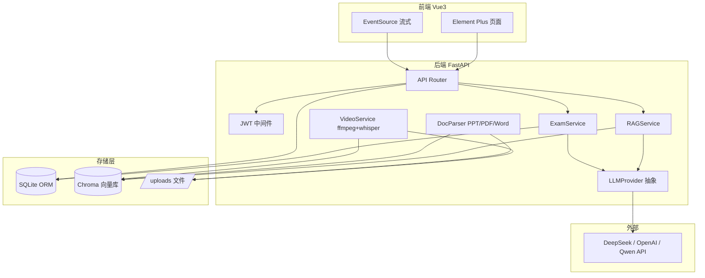

# C语言程序设计课程智能体 开发计划

## 一、技术栈与选型确认

| 模块 | 技术 | 说明 |
|------|------|------|
| 前端 | Vue3 + Vite + Element Plus + Pinia + Vue Router + axios/EventSource | SSE 用 EventSource 消费 |
| 后端 | Python 3.11 + FastAPI + Uvicorn + SQLAlchemy 2.x + Pydantic v2 | |
| 数据库 | SQLite (`data/course.db`) | 通过 SQLAlchemy ORM |
| 向量库 | Chroma (persistent 本地模式, `data/chroma/`) | |
| RAG | LangChain (`langchain` + `langchain-community` + `langchain-chroma`) | |
| LLM | 抽象 `LLMProvider` 接口, 默认 DeepSeek, 可切 OpenAI / Qwen | 通过 OpenAI 兼容协议 |
| 文档解析 | `pdfplumber` / `python-pptx` / `python-docx` | |
| 视频处理 | `ffmpeg-python` + `openai-whisper`(本地) 或 阿里语音 API(备选) | 字幕进 RAG, 时间戳元数据映射 |
| 流式 | `sse-starlette` 的 `EventSourceResponse` | |
| 认证 | `python-jose` JWT + `passlib[bcrypt]` | |
| 部署 | docker-compose (frontend nginx + backend uvicorn) + 持久化 volume | |

### 关键风险与权衡

1. **视频帧视觉嵌入**：DeepSeek 无多模态。基础版只做「字幕转写 → 切片进 Chroma → chunk 元数据带 `video_id` + `start_time` → 检索命中后返回可跳转时间点」，此方案 1-2 周内可完成且满足"精准定位视频时间对应知识点"。**视觉帧嵌入列为创新扩展**，用 `sentence-transformers` + CLIP 或通义千问 VL，时间允许再加。
2. **Whisper 本地转写**：模型下载 ~1.5GB，docker 镜像变大。默认走本地 `whisper tiny` 模型；如部署环境受限，README 提供「切换为阿里云 NLS API」的配置开关。
3. **LLM 评分一致性**：考核评价用「题库标准答案 + LLM 二次评判 + 维度打分」混合，避免纯 LLM 评分漂移。

## 二、系统架构



## 三、目录结构

```
专业课程设计/
├── backend/
│   ├── app/
│   │   ├── main.py                 # FastAPI 入口, CORS, 路由挂载
│   │   ├── config.py               # 环境变量 / 配置
│   │   ├── database.py             # SQLAlchemy engine + session
│   │   ├── models/                 # ORM 模型
│   │   ├── schemas/                # Pydantic
│   │   ├── api/                    # routers: auth, users, llm, agents, materials, chapters, exams, logs, chat
│   │   ├── services/
│   │   │   ├── llm_provider.py     # 抽象 + DeepSeek/OpenAI/Qwen 实现
│   │   │   ├── rag_service.py      # LangChain + Chroma 检索 + 流式生成
│   │   │   ├── doc_parser.py       # PDF/PPT/Word 解析切片
│   │   │   ├── video_service.py    # ffmpeg 抽帧 + whisper 字幕 + 时间戳
│   │   │   ├── exam_service.py     # 试卷生成(题库+LLM) + 评分 + 报告
│   │   │   └── recommend_service.py
│   │   └── deps.py                 # 依赖注入 (当前用户, DB session)
│   ├── scripts/init_db.py          # 建表 + 默认 admin + 示例课程
│   ├── scripts/seed_materials.py   # 导入真实课程资料
│   ├── requirements.txt
│   └── Dockerfile
├── frontend/
│   ├── src/
│   │   ├── api/                    # axios 封装 + SSE 封装
│   │   ├── stores/                 # pinia: auth, llm, exam
│   │   ├── router/
│   │   ├── views/
│   │   │   ├── Login.vue / Register.vue
│   │   │   ├── Home.vue
│   │   │   ├── LLMConfig.vue
│   │   │   ├── AgentManage.vue
│   │   │   ├── CallLogs.vue
│   │   │   ├── Chat.vue            # 通用对话(流式)
│   │   │   ├── AgentIntro.vue
│   │   │   ├── CourseQA.vue        # 课程问答(流式+推荐)
│   │   │   ├── ChapterRoute.vue    # 章节学习路线
│   │   │   ├── ExamRunner.vue      # 逐题答题
│   │   │   ├── ExamReport.vue
│   │   │   └── teacher/            # 资料上传/章节配置/题库
│   │   ├── components/
│   │   └── App.vue / main.ts
│   ├── vite.config.ts
│   ├── package.json
│   └── Dockerfile
├── data/                           # 持久化(sqlite+chroma+uploads)
├── docs/
│   ├── 系统设计.md
│   ├── 功能说明.md
│   ├── 数据结构设计.md
│   └── API接口文档.md
├── docker-compose.yml
├── README.md
└── .env.example
```

## 四、数据库设计 (SQLite ORM)

核心表（详见 `docs/数据结构设计.md`）：

- `users(id, username, password_hash, role[student/teacher/admin], created_at)`
- `chapters(id, course_id, title, order_idx, description)`
- `knowledge_points(id, chapter_id, name)`
- `materials(id, chapter_id, type[ppt/pdf/video/word], title, file_path, meta_json)`
- `video_segments(id, video_id, start_sec, end_sec, subtitle_text)` — 字幕分段时间锚点
- `exam_configs(id, chapter_id, config_json)` — `{"选择题":2,"判断题":2,"简答题":2}` + 知识点列表
- `question_bank(id, chapter_id, kp_id, type, stem, options_json, answer, analysis)`
- `exams(id, user_id, chapter_id, status[ongoing/submitted], started_at, submitted_at)`
- `exam_questions(id, exam_id, idx, source[bank/llm], type, stem, options_json, user_answer, is_correct, ai_score, ai_feedback)`
- `exam_reports(id, exam_id, dimensions_json, summary, suggestions, created_at)`
- `chapter_progress(id, user_id, chapter_id, status[未完成/已完成/待学习], last_exam_id)`
- `llm_configs(id, provider, api_key, base_url, model, is_default)`
- `call_logs(id, user_id, endpoint, req_summary, resp_summary, tokens, latency_ms, created_at)`

向量库 Chroma collections：
- `course_knowledge` — 文档/字幕切片，metadata: `{material_id, chapter_id, type, page, start_sec, end_sec}`

## 五、API 接口规划 (关键)

详见 `docs/API接口文档.md`，主要分组：

- **认证/用户** `POST /api/auth/register|login` `GET/PUT /api/users/me`
- **LLM 配置** `GET/POST/PUT/DELETE /api/llm-configs`
- **智能体** `GET /api/agents` `GET /api/agents/{id}` (介绍)
- **通用对话** `POST /api/chat` (SSE)
- **课程问答** `POST /api/agents/course/ask` (SSE, RAG) → 返回流式答案 + 推荐资源列表
- **资源推荐** `POST /api/recommend` body `{chapter_id?, question}` → `[{type, title, material_id, chapter, section, video_start_sec?}]`
- **资料管理(教师)** `POST /api/materials/upload` (multipart) `POST /api/materials/reindex` `GET /api/materials`
- **章节** `GET /api/chapters` `GET /api/chapters/{id}/progress`
- **考核配置(教师)** `GET/POST/PUT /api/exam-configs/{chapter_id}`
- **题库(教师)** `GET/POST/PUT/DELETE /api/question-bank`
- **考核(学生)** `POST /api/exams/start` `POST /api/exams/{id}/answer` `POST /api/exams/{id}/submit` `GET /api/exams/{id}/report`
- **日志** `GET /api/logs`

## 六、开发阶段与任务（1-2 周紧凑）

### 阶段 0 · 项目脚手架（Day 1）
- 初始化 `backend/` (FastAPI + SQLAlchemy + 路由占位) 与 `frontend/` (Vite + Element Plus + Router + Pinia)
- `docker-compose.yml` 框架、`.env.example`、`requirements.txt`、`package.json`
- `scripts/init_db.py` 建表脚本，能跑出空库 + admin 账号

### 阶段 1 · 用户与系统管理（Day 2-3）
- JWT 注册/登录/受保护路由；前端登录态 Pinia + 路由守卫
- 页面：首页、LLM 配置页、智能体管理(列表+介绍)、调用历史日志
- `LLMProvider` 抽象 + DeepSeek 实现；`call_logs` 中间件记录所有 LLM 调用
- 通用对话页 `Chat.vue` 走 SSE 流式（先打通流式管线，RAG 后接）

### 阶段 2 · 知识库构建（Day 4-5）  ★核心基础
- `doc_parser.py`：PDF/PPT/Word → 文本 → RecursiveCharacterTextSplitter 切片
- `video_service.py`：ffmpeg 抽音频 → whisper 转字幕 → 按 30s 分段写 `video_segments` + 字幕文本切片进 Chroma（metadata 带 `start_sec/end_sec/video_id`）
- 教师资料上传页 `teacher/Materials.vue`：拖拽上传、章节归属、触发索引
- `POST /api/materials/reindex` 全量重建 Chroma
- 用真实 C 语言课程资料跑通端到端导入

### 阶段 3 · 课程问答 + 资源推荐（Day 6）
- `rag_service.py`：Chroma similarity_search → 组装 prompt → LLM 流式生成
- `POST /api/agents/course/ask` (SSE)：先回传推荐资源 JSON 头部，再流式答案
- `recommend_service.py`：检索 chunk 的 metadata → 反查 `materials` + `chapters`，视频 chunk 返回 `video_start_sec` 实现精准跳转
- 前端 `CourseQA.vue`：流式渲染答案 + 右侧「建议学习」卡片（PPT/PDF/视频带时间戳）

### 阶段 4 · 章节考核（Day 7-9）  ★重点功能
- 教师端：章节配置页（题型+数量+知识点）、题库 CRUD 页
- `exam_service.generate_paper()`：按 config 从题库抽题，不足题型用 LLM 基于知识点生成补足（prompt 含章节上下文）
- `ExamRunner.vue`：逐题作答、进度条、暂存、提交；中途 `POST /answer` 落库
- `exam_service.grade()`：客观题直接判；简答题用 LLM 按「标准答案 + 维度」评分，返回 `ai_score + ai_feedback`
- `exam_service.generate_report()`：LLM 按 4 维度（知识掌握/基础概念/综合分析/建议复习）生成评价报告
- `ChapterRoute.vue`：章节路线图，状态色标（未完成/已完成/待学习），入口「开始第N章考核」
- `ExamReport.vue`：雷达图 + 维度评语 + 错题回顾 + 复习建议

### 阶段 5 · 创新、文档、部署、演示（Day 10-14）
- **创新扩展**（任选 1-2 项，对应验收 20%）：
  - 视频视觉帧嵌入（CLIP/通义千问 VL）提升检索精度
  - 学习路径自适应（基于考核薄弱知识点自动推荐下一章复习资源）
  - 教师题库 AI 辅助生成
- 文档：`docs/` 四份 + `README.md`（部署/配置/排错）
- `docker-compose up` 一键启动验证（前端 nginx 反代后端，volume 持久化 `data/`）
- 演示视频脚本（≥10 分钟）：登录→上传资料→问答→推荐→章节考核→报告
- 稳定性自测：并发问答、断网重连 SSE、长视频转写、考试交卷幂等

## 七、验收指标对照

| 指标 | 占比 | 对应交付 |
|------|------|----------|
| 智能体功能完整性 | 30% | RAG 问答 + 资源推荐 + 章节考核评价 三大功能全跑通 |
| 前后端系统开发 | 30% | Vue3 + FastAPI 完整页面 + API + 用户/系统管理 |
| 系统稳定性 | 10% | SSE 断连重连、考试幂等、异常处理、docker 一键起 |
| 文档规范 | 10% | `docs/` 四份 + README + API 文档 |
| 创新与扩展 | 20% | 视频时间精准定位 / 视觉帧嵌入 / 自适应学习路径 / 题库 AI 辅助 |

## 八、需要用户后续提供的素材

1. 真实 C 语言课程资料文件包（PPT/PDF/视频/教案），放入 `backend/uploads/` 或通过教师端上传
2. 至少一门 LLM 的 API Key（DeepSeek 推荐）
3. 章节目录初步列表（如「第1章 C语言概述 / 第5章 树与AVL」），用于 `init_db.py` 种子数据
4. 若用阿里云语音转写替代本地 whisper，需提供 AccessKey

> 说明：以上 4 项不阻塞开发，可用占位数据先把全链路打通，再替换为真实素材。
