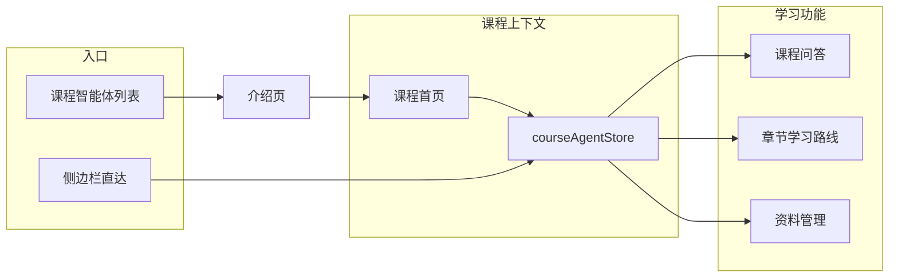

# 多课程智能体扩展计划

## 现状评估（难度：中等）

代码库中 **Phase 1 骨架已基本落地**，与你描述的 DOM（单卡片、「进入课程问答」直跳 `/course-qa`）不一致，多半是**前端未热更新或数据库迁移未生效**。重启后端并刷新浏览器后应看到新 UI。

| 能力 | 状态 | 关键文件 |
|------|------|----------|
| Agent 绑定课程、slug、status | 已实现 | [`backend/app/models/__init__.py`](backend/app/models/__init__.py) |
| DB 迁移 + 种子（C/Java/Python） | 已实现 | [`backend/scripts/init_db.py`](backend/scripts/init_db.py) `migrate_agents_extend` |
| 多智能体列表卡片 | 已实现 | [`frontend/src/views/AgentManage.vue`](frontend/src/views/AgentManage.vue) |
| 介绍页 → 课程首页 | 已实现 | [`frontend/src/views/AgentIntro.vue`](frontend/src/views/AgentIntro.vue) → `/agents/:id/home` |
| 课程智能体首页 | 已实现 | [`frontend/src/views/CourseAgentHome.vue`](frontend/src/views/CourseAgentHome.vue) |
| 章节按 course_id 过滤 | 部分实现 | [`backend/app/api/chapters.py`](backend/app/api/chapters.py) + 前端传参 |
| RAG/Chroma 按课程隔离 | **未实现** | [`backend/app/services/rag_service.py`](backend/app/services/rag_service.py) 仍硬编码 C 语言提示词 |
| 侧边栏记住当前课程 | **未实现** | [`frontend/src/stores/courseAgent.ts`](frontend/src/stores/courseAgent.ts) 仅存 id，未自动恢复 |

---

## Phase 1 补齐（本次优先，约 1–2 天）

目标：满足「多智能体列表 → 介绍 → **课程首页**」流程；侧边栏保留直达，并**默认记住上次课程**（你的选择）。

### 1. 验证迁移与数据

- 重启 backend，确认启动日志出现 `agents.course_id/slug/status` 迁移及 Java/Python 种子
- 调用 `GET /api/agents` 应返回 3 条：`c-lang`(active)、`java`/`python`(planned)

### 2. 完善 `courseAgentStore` 自动恢复

修改 [`frontend/src/stores/courseAgent.ts`](frontend/src/stores/courseAgent.ts)：

- 新增 `restoreAgent()`：`localStorage.course_agent_id` → `GET /agents/:id` 填充 `current`
- 在 [`CourseQA.vue`](frontend/src/views/CourseQA.vue)、[`ChapterRoute.vue`](frontend/src/views/ChapterRoute.vue) 的 `onMounted` 中：若 `current` 为空则 `restoreAgent()`；仍为空则提示「请先从课程智能体选择课程」并给出跳转链接
- 无 active 智能体时（Java/Python）课程首页保持禁用，侧边栏进入 QA 时同样拦截

### 3. 课程上下文 UI 统一

- **课程问答 / 章节路线** 顶栏显示当前智能体名称（已有 tag，补齐未选择时的提示条）
- **课程智能体首页** 作为每门课的「子首页」，卡片跳转时确保 `setAgent` 已执行
- 侧边栏菜单文案：[`Layout.vue`](frontend/src/views/Layout.vue) 已将「智能体管理」改为「课程智能体」；课程问答旁可加小字显示当前课程（可选）

### 4. 后端 API 传递 agent_id（轻量）

修改 [`backend/app/api/agents.py`](backend/app/api/agents.py) `CourseAskIn`：

- 增加 `agent_id: int | None`
- 根据 `agent_id` 查 `Agent.course_id`，与 `class_id` 一起参与检索范围（当前仅 class 隔离）

历史记录 `course/history` 可暂不按 agent 过滤（后续 Phase 2）。

---

## Phase 2 多课程完全隔离（后续，约 3–5 天）

目标：Java/Python 上传教材后可 `status=active`，与 C 语言**数据与检索互不干扰**。

### 1. 数据层

- `courses` 表新增 Java、Python 课程记录（章节可先用占位或导入模板）
- `materials` / `question_bank` / `exam_config` 通过 `chapter.course_id` 间接归属；资料上传 UI 增加**课程筛选**（[`Materials.vue`](frontend/src/views/teacher/Materials.vue)）
- `TeachingClass` 可选扩展 `course_id`（若同一教师教多门课且班级要分课程）；否则短期方案：**班级资料仍按 class 隔离，章节列表按 course 过滤**

### 2. 向量库按课程过滤

- [`indexer.py`](backend/app/services/indexer.py) metadata 增加 `course_id`（来自 `material.chapter.course_id`）
- [`rag_service.py`](backend/app/services/rag_service.py) `_build_where` 增加 `course_id` 条件
- [`recommend_service.py`](backend/app/services/recommend_service.py) 附件关键词检索传入 `course_id`
- 系统提示词从硬编码改为按 `Agent.slug` 加载模板（如 `C_LANG_SYSTEM_PROMPT` / `JAVA_SYSTEM_PROMPT`）

### 3. 教学功能按课程 scoped

- 考核配置、题库管理、考核记录：header 增加课程选择器（与班级选择器并列），API 按 `chapter.course_id` 过滤
- 考试组卷 [`exam_service.py`](backend/app/services/exam_service.py) 仅抽当前课程章节题库

### 4. 启用 Java/Python

- 管理端或 seed 脚本：创建课程 + 绑定 `Agent.course_id` + `status='active'`
- 教师上传对应教材并 reindex 后即可在课程首页开放问答

---

## 验收标准

**Phase 1**

- [ ] `/agents` 显示 C/Java/Python 三张卡片，筹备中课程不可进入首页
- [ ] C 语言：列表 → 介绍 → **进入课程首页** → 课程问答/章节路线
- [ ] 侧边栏直达课程问答时，自动恢复上次选择的 C 语言智能体；未选择时有明确引导
- [ ] 章节列表仅显示当前 `course_id` 对应章节

**Phase 2**

- [ ] 两门课程资料索引互不影响，问答推荐只命中本课程 PDF 页码
- [ ] Java/Python 接入教材后可切换为「已上线」

---

## 建议实施顺序

1. 验证迁移 + 修复 store 自动恢复（最快见效）
2. 课程问答/章节无上下文时的引导 UX
3. `agent_id` + `course_id` 传入 RAG（C 语言行为不变）
4. Phase 2 按课程维度扩展 indexer / prompts / 教学页筛选
