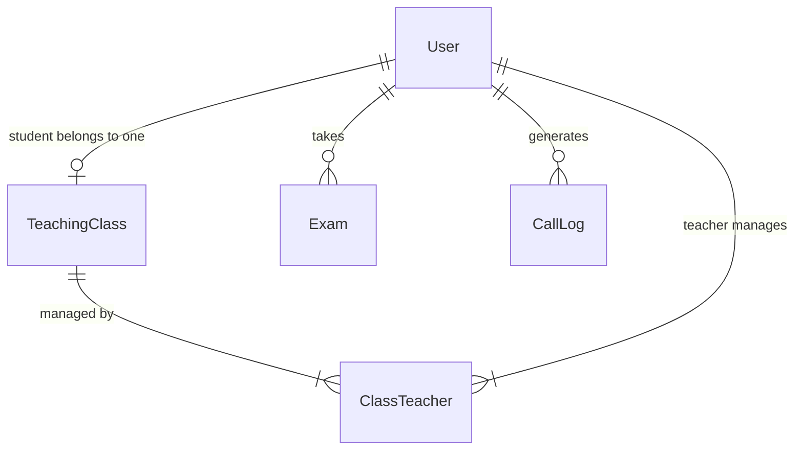
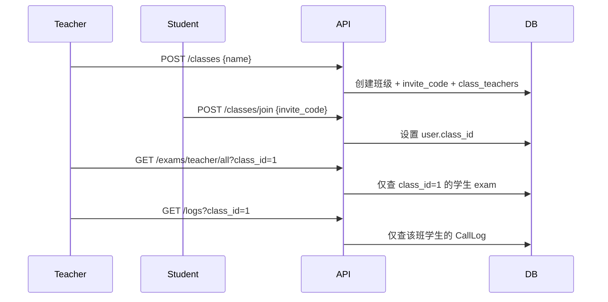

# 班级管理功能实现计划

## 现状与目标

当前系统使用扁平角色模型（`student` / `teacher` / `admin`），教师端 [`backend/app/api/exams.py`](backend/app/api/exams.py) 的 `/teacher/all`、`/teacher/students` 与 [`backend/app/api/logs.py`](backend/app/api/logs.py) 的 `/logs` 均**无班级隔离**，可查看全部学生数据。

目标关系：



- 一个学生最多属于一个班级（`User.class_id`）
- 一个班级可有多个教师（`class_teachers` 多对多）
- 一个教师可管理多个班级
- **教师**只能看自己管理班级内学生的考核记录与调用日志
- **admin** 保持全局可见（与现有行为一致）

---

## 1. 数据模型

在 [`backend/app/models/__init__.py`](backend/app/models/__init__.py) 新增：

| 表 | 字段 | 说明 |
|---|---|---|
| `teaching_classes` | `id`, `name`, `invite_code`(unique, 6位), `created_by`, `created_at` | 班级 |
| `class_teachers` | `class_id`, `user_id` (联合主键) | 班级-教师多对多 |
| `users` 扩展 | `class_id` (nullable FK → `teaching_classes.id`) | 学生所属班级 |

**约束逻辑（应用层）：**
- 仅 `role=student` 的用户可设置 `class_id`
- 创建班级时自动将创建者写入 `class_teachers`
- 加入新班级前若已有班级：需先退出（或教师移除）再加入
- `invite_code` 创建时随机生成（如 `secrets.token_hex(3).upper()`），支持教师刷新

[`backend/scripts/init_db.py`](backend/scripts/init_db.py) 补充演示数据：创建示例班级「2025软院C语言1班」，将种子 `student` 加入，`teacher` 设为管理教师。

> SQLite 无正式 migration 工具，采用 `Base.metadata.create_all` 增量建表 + 在 `init_db` 中检测并 `ALTER TABLE users ADD COLUMN class_id`（若列不存在）以兼容已有数据库。

---

## 2. 权限辅助函数

在 [`backend/app/deps.py`](backend/app/deps.py) 新增可复用函数：

```python
def get_managed_class_ids(db, user: User) -> list[int] | None:
    # admin → None（表示不限制）
    # teacher → 该教师 class_teachers 中的 class_id 列表

def get_class_student_ids(db, class_ids: list[int]) -> list[int]:
    # 返回这些班级内的 student user_id 列表

def assert_teacher_manages_class(db, user, class_id) -> None:
    # 非 admin 且不在 class_teachers 中 → 403

def assert_teacher_can_view_student(db, user, student_id) -> None:
    # 验证目标学生属于教师管理的班级
```

---

## 3. 后端 API（新路由 `classes`）

新建 [`backend/app/api/classes.py`](backend/app/api/classes.py)，在 [`backend/app/main.py`](backend/app/main.py) 注册 `/api/classes`。

### 教师端（`require_role("teacher", "admin")`）

| 方法 | 路径 | 功能 |
|---|---|---|
| GET | `/classes/mine` | 我管理的班级列表（含学生数、邀请码） |
| POST | `/classes` | 创建班级 `{name}` |
| PUT | `/classes/{id}` | 修改班级名称 |
| DELETE | `/classes/{id}` | 删除班级（学生 `class_id` 置空，删关联） |
| POST | `/classes/{id}/regenerate-code` | 刷新邀请码 |
| GET | `/classes/{id}/students` | 班级学生列表 |
| POST | `/classes/{id}/students` | 手动添加学生 `{username}` |
| DELETE | `/classes/{id}/students/{user_id}` | 移除学生 |
| GET | `/classes/{id}/teachers` | 班级教师列表 |
| POST | `/classes/{id}/teachers` | 添加管理教师 `{username}`（须为 teacher/admin） |
| DELETE | `/classes/{id}/teachers/{user_id}` | 移除教师（不可移除最后一名教师） |

### 学生端（`require_role("student")`）

| 方法 | 路径 | 功能 |
|---|---|---|
| GET | `/classes/my` | 当前班级信息（未加入则 `class: null`） |
| POST | `/classes/join` | 邀请码加入 `{invite_code}` |
| POST | `/classes/leave` | 退出当前班级 |

### Schemas

新建 [`backend/app/schemas/classes.py`](backend/app/schemas/classes.py)；扩展 [`backend/app/schemas/auth.py`](backend/app/schemas/auth.py) 的 `UserOut` 增加可选 `class_id`、`class_name`（`/users/me` 返回当前班级信息）。

---

## 4. 改造现有教师查询（核心隔离）

### [`backend/app/api/exams.py`](backend/app/api/exams.py)

修改以下端点，注入 `CurrentUser` 并按班级过滤：

- `GET /teacher/all`：新增可选 `class_id` 参数；**teacher** 自动限制为 `user_id IN 所管班级学生`；**admin** 不限制
- `GET /teacher/all/{exam_id}/report`：增加 `assert_teacher_can_view_student` 校验
- `GET /teacher/students`：仅返回所管班级内的学生；支持 `class_id` 筛选

### [`backend/app/api/logs.py`](backend/app/api/logs.py)

- `GET /logs`：新增可选 `class_id` 参数；**teacher** 自动限制为 `CallLog.user_id IN 所管班级学生`；**admin** 不限制
- 列表项补充 `username` / `display_name` 便于教师识别

---

## 5. 前端改造

### 路由 [`frontend/src/router/index.ts`](frontend/src/router/index.ts)

| 路径 | 角色 | 页面 |
|---|---|---|
| `/my-class` | student | 我的班级 |
| `/teacher/classes` | teacher, admin | 班级管理 |

### 学生页：[`frontend/src/views/MyClass.vue`](frontend/src/views/MyClass.vue)（新建）

- 展示当前班级名称、管理教师列表
- 未加入：输入邀请码 +「加入班级」
- 已加入：「退出班级」按钮（确认后调用 `/classes/leave`）
- 加入成功后刷新 `auth.fetchMe()`

### 教师页：[`frontend/src/views/teacher/Classes.vue`](frontend/src/views/teacher/Classes.vue)（新建）

- 班级卡片/表格：名称、邀请码（复制按钮）、学生数
- 操作：创建班级、编辑名称、刷新邀请码、删除
- 选中班级后子面板：
  - **学生管理**：列表 + 按用户名添加 + 移除
  - **教师管理**：列表 + 按用户名添加 + 移除

### 现有页面微调

- [`frontend/src/views/Layout.vue`](frontend/src/views/Layout.vue)：学生菜单加「我的班级」；教师菜单加「班级管理」
- [`frontend/src/views/teacher/ExamRecords.vue`](frontend/src/views/teacher/ExamRecords.vue)：增加班级筛选下拉（`GET /classes/mine`），传给 `/exams/teacher/all?class_id=`
- [`frontend/src/views/CallLogs.vue`](frontend/src/views/CallLogs.vue)：增加班级筛选下拉，传给 `/logs?class_id=`
- [`frontend/src/stores/auth.ts`](frontend/src/stores/auth.ts) + [`frontend/src/api/auth.ts`](frontend/src/api/auth.ts)：`UserOut` 扩展 `class_id` / `class_name`

---

## 6. 数据流示意



---

## 7. 边界情况

| 场景 | 处理 |
|---|---|
| 学生已在班级 A，输入 B 班邀请码 | 返回 400「请先退出当前班级」 |
| 教师查看非本班学生报告 | 403 |
| 教师无班级 | 考核记录/日志/学生列表为空 |
| 删除班级 | 学生 `class_id` 置 null，删 `class_teachers` |
| 现有未分班学生 | 教师不可见，直至加入班级或被手动添加 |
| admin 角色 | 不受班级限制，可选 `class_id` 筛选 |

---

## 8. 验证步骤

1. 运行 `python -m scripts.init_db`（或 `--reset`）确保新表与演示班级存在
2. 教师登录 → 班级管理 → 创建班级 → 复制邀请码
3. 学生登录 → 我的班级 → 输入邀请码加入
4. 教师 → 考核记录/调用日志：仅能看到本班学生；切换班级筛选正确
5. 教师手动添加/移除学生、添加共管教师均生效
6. admin 登录仍能看到全部记录
7. 非本班教师访问 `/teacher/all/{exam_id}/report` 返回 403
