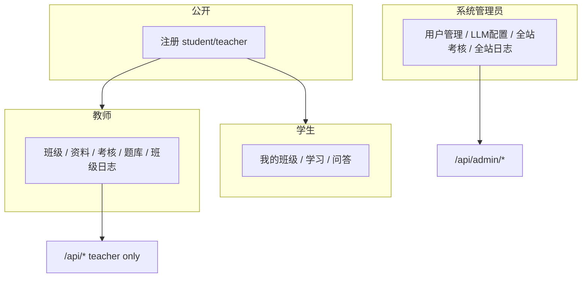
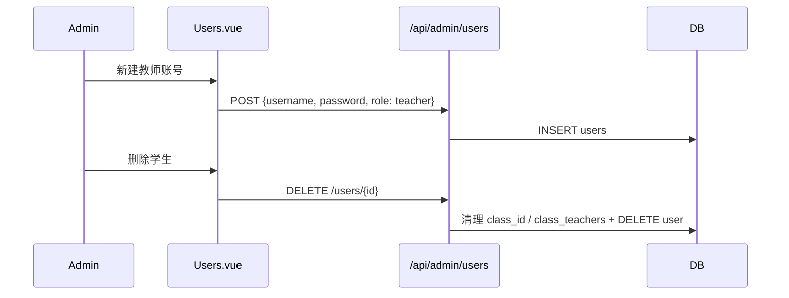

# 管理员系统管理功能计划

## 现状问题

- 前端 [`frontend/src/views/Layout.vue`](frontend/src/views/Layout.vue) 用 `isTeacher = ['teacher','admin']`，管理员与教师**菜单完全相同**
- 后端所有特权接口均为 `require_role("teacher", "admin")`，管理员仅是**数据范围更大**，无专属能力
- [`backend/app/api/users.py`](backend/app/api/users.py) 仅有 `GET /users/me`，**无用户管理 API**
- [`backend/app/api/auth.py`](backend/app/api/auth.py) 公开注册接受 `role=admin`（前端虽无选项，但 API 可绕过）——需封堵

## 目标架构



| 能力 | 教师 | 管理员 |
|------|------|--------|
| 班级/资料/考核配置/题库 | 是（所管班级范围） | **否** |
| 班级考核记录 / 班级日志 | 是（所管班级） | **否** |
| 用户增删改 / 重置密码 | 否 | **是** |
| LLM 配置 | 否 | **是** |
| 全站考核记录 / 全站日志 | 否 | **是** |
| 课程问答 / 章节学习 | 是 | 是（与普通用户相同） |

---

## 1. 后端：封堵注册 + 权限拆分

### 1.1 公开注册限制

[`backend/app/api/auth.py`](backend/app/api/auth.py)：

- 若 `payload.role == "admin"` → 返回 403「管理员账号仅能由系统管理员创建」
- 保持 student / teacher 可公开注册（按你的选择）

[`backend/app/schemas/auth.py`](backend/app/schemas/auth.py)：`UserCreate.role` 的 pattern 可改为 `^(student|teacher)$`（与前端一致）

### 1.2 教学类 API 改为仅教师

将以下文件中的 `require_role("teacher", "admin")` 改为 `require_role("teacher")`：

- [`backend/app/api/materials.py`](backend/app/api/materials.py)
- [`backend/app/api/classes.py`](backend/app/api/classes.py)（`/mine` 等教师端）
- [`backend/app/api/exams.py`](backend/app/api/exams.py) 中 config/bank/knowledge-points 及 `/teacher/*` 路由
- [`backend/app/api/logs.py`](backend/app/api/logs.py) 整路由改为 `require_role("teacher")`

[`backend/app/api/llm.py`](backend/app/api/llm.py) 写操作（POST/PUT/DELETE）改为 `require_role("admin")`；GET 列表可保持登录用户可读（供对话页使用）

### 1.3 新增管理员 API

新建 [`backend/app/api/admin.py`](backend/app/api/admin.py)，前缀 `/admin`，全部 `require_role("admin")`，在 [`backend/app/main.py`](backend/app/main.py) 注册。

**用户管理** `schemas` 扩展于 [`backend/app/schemas/auth.py`](backend/app/schemas/auth.py) 或新建 `admin.py`：

| 方法 | 路径 | 功能 |
|------|------|------|
| GET | `/admin/users` | 分页列表，支持 `role` 筛选、用户名搜索 |
| POST | `/admin/users` | 创建用户（username/password/role/display_name），**可创建 admin** |
| PUT | `/admin/users/{id}` | 修改 `display_name`、`role` |
| DELETE | `/admin/users/{id}` | 删除用户 |
| POST | `/admin/users/{id}/reset-password` | 重置密码 |

**删除/改角色安全规则**（应用层）：

- 不能删除/降级**当前登录的自己**
- 系统至少保留 **1 个 admin**（最后一个 admin 不可删、不可改角色）
- 删除前清理关联：`class_id` 置空、`class_teachers` 删除、不物理删除 `exams`/`call_logs`（保留 `user_id` 历史，或按现有 nullable 处理）

**全站监控**（复用现有查询逻辑，无班级范围限制）：

| 方法 | 路径 | 说明 |
|------|------|------|
| GET | `/admin/exams` | 等同现 `/exams/teacher/all`，admin 全局 |
| GET | `/admin/exams/{id}/report` | 全站考核报告 |
| GET | `/admin/exams/students` | 全部学生列表（筛选用） |
| GET | `/admin/logs` | 全站调用日志 |

可从 [`backend/app/api/exams.py`](backend/app/api/exams.py) / [`backend/app/api/logs.py`](backend/app/api/logs.py) 抽取公共查询函数到 `services/admin_service.py` 或 `deps.py`，避免重复 SQL。

---

## 2. 前端：菜单与路由分离

### 2.1 侧边栏 [`frontend/src/views/Layout.vue`](frontend/src/views/Layout.vue)

```typescript
const isAdmin = computed(() => auth.user?.role === 'admin')
const isTeacher = computed(() => auth.user?.role === 'teacher')
```

**管理员菜单**（系统管理）：

- 用户管理 → `/admin/users`
- 大模型配置 → `/llm-config`
- 全站考核记录 → `/admin/exam-records`
- 全站调用日志 → `/admin/logs`

**教师菜单**（保持不变，去掉 admin 共用）：

- 班级管理、资料管理、考核配置、题库管理、考核记录、调用日志

**共用**：首页、大模型对话、课程问答、章节学习路线、智能体管理

Header 角色显示：`admin` →「系统管理员」，`teacher` →「教师」

### 2.2 路由 [`frontend/src/router/index.ts`](frontend/src/router/index.ts)

| 路径 | 角色 | 组件 |
|------|------|------|
| `/admin/users` | admin | 新建 `admin/Users.vue` |
| `/admin/exam-records` | admin | 复用 `ExamRecords.vue`（admin 模式） |
| `/admin/exams/:id/report` | admin | 复用 `ExamReport.vue` |
| `/admin/logs` | admin | 复用 `CallLogs.vue`（admin 模式） |
| `/llm-config` | **admin**（从 teacher,admin 改为 admin） |
| `/teacher/*`、`/logs` | **teacher**（从 teacher,admin 改为 teacher） |

### 2.3 新建用户管理页

[`frontend/src/views/admin/Users.vue`](frontend/src/views/admin/Users.vue)：

- 表格：ID、用户名、昵称、角色、班级（学生显示 class_name）、注册时间
- 筛选：角色下拉、用户名搜索
- 操作：新建用户（弹窗）、编辑（角色/昵称）、重置密码、删除（确认）
- 调用 `/api/admin/users*`

### 2.4 复用监控页

[`ExamRecords.vue`](frontend/src/views/teacher/ExamRecords.vue)、[`CallLogs.vue`](frontend/src/views/CallLogs.vue)：

- 根据路由是否含 `/admin/` 切换 API 前缀（`/admin/exams` vs `/exams/teacher/all`，`/admin/logs` vs `/logs`）
- 管理员视图：班级筛选下拉来自全站班级（可调 `GET /classes/mine` 改为 admin 专用 `GET /admin/classes` 或 admin 用户管理页不依赖班级 API——考核记录页用 `/admin/exams/students` + 可选新增 `GET /admin/classes` 列全部班级）

建议在 admin API 增加 `GET /admin/classes` 返回全部班级（供筛选），避免 admin 无法访问 `/classes/mine`。

---

## 3. 数据流



---

## 4. 验证步骤

1. 公开注册选「教师」成功；用 API 直接传 `role=admin` 应被拒绝
2. `admin` 登录：只见系统管理菜单，**无**班级/资料/考核配置入口
3. `teacher` 登录：只见教学菜单，**无**用户管理入口；访问 `/admin/users` 被路由重定向
4. 管理员可创建/编辑/删除用户、重置密码；不能删除最后一个 admin
5. 管理员全站考核记录/日志可查看所有学生数据；教师仅本班
6. 学生/教师原有学习功能不受影响

---

## 主要改动文件

| 层 | 文件 |
|----|------|
| 后端 | `api/auth.py`, `api/admin.py`(新), `api/materials.py`, `api/classes.py`, `api/exams.py`, `api/logs.py`, `api/llm.py`, `schemas/auth.py`, `main.py` |
| 前端 | `Layout.vue`, `router/index.ts`, `views/admin/Users.vue`(新), `ExamRecords.vue`, `CallLogs.vue`, `ExamReport.vue` |
