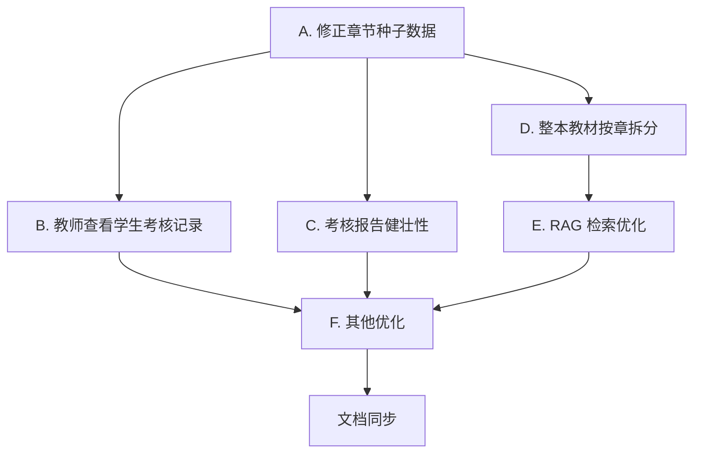

# C语言课程智能体 完善与优化计划

## 一、问题诊断汇总

经代码库详查 + 课本 PDF 目录提取，确认以下问题：

| # | 问题 | 根因位置 |
|---|------|----------|
| 1 | 单元测试无法生成成绩和报告 | 报告生成逻辑实际存在（`exam_service.generate_report`），但**仅第 6 章配了 ExamConfig**，第 1–5 章开考直接抛 `该章节未配置考核`；且 `history/mine` 不含分数，教师**无任何接口**查看学生记录 |
| 2 | 上传文件无法解析 / RAG 无法识别章节 | PDF 解析本身正常（[doc_parser.py](backend/app/services/doc_parser.py)），但 chunk 的 `chapter_id` 完全依赖上传时手选，整本 PDF 全部绑到一章 → 其他章过滤检索为空 |
| 3 | 整本课本只能选一章上传 | [materials.py:55](backend/app/api/materials.py) `upload` 强制单 `chapter_id`；无按目录拆章逻辑 |
| 4 | 章节与课本不符 | [init_db.py:68-87](backend/scripts/init_db.py) 6 章占位（含错误的「树与AVL树」），真实课本为 17 章（第 0–16 章，三篇结构） |
| 5 | 其他优化点 | 见下文「五」 |

## 二、课本真实章节结构（已从 PDF 目录提取）

《C程序设计快速进阶大学教程》蒋光远，清华大学出版社，三篇 17 章：

```mermaid
flowchart LR
    subgraph P0 [第0章]
        C0["第0章 概述"]
    end
    subgraph P1 [第1篇 感知篇]
        C1["第1章 数据的基本操作"]
        C2["第2章 结构化程序设计初探"]
        C3["第3章 数据结构"]
        C4["第4章 算法描述和编码规范"]
    end
    subgraph P2 [第2篇 详解篇]
        C5["第5章 数据类型与输入输出"]
        C6["第6章 运算符与表达式"]
        C7["第7章 选择结构"]
        C8["第8章 循环结构"]
        C9["第9章 数组"]
        C10["第10章 函数"]
        C11["第11章 指针"]
        C12["第12章 自定义数据类型"]
        C13["第13章 文件"]
    end
    subgraph P3 [第3篇 进阶篇]
        C14["第14章 函数进阶"]
        C15["第15章 数组进阶"]
        C16["第16章 数据管理"]
    end
    C0 --> C1 --> C2 --> C3 --> C4 --> C5 --> C6 --> C7 --> C8 --> C9 --> C10 --> C11 --> C12 --> C13 --> C14 --> C15 --> C16
```



各章知识点（取自目录小节，用于 KnowledgePoint + ExamConfig）：

| 章 | 标题 | 知识点 |
|----|------|--------|
| 0 | 概述 | 计算机由来与组成、C语言发展史、C程序基本结构、程序开发步骤、集成开发环境 |
| 1 | 数据的基本操作 | 数据的存储与输出、数据的输入与运算、数据的比较与判断 |
| 2 | 结构化程序设计初探 | 重复与循环语句、基本结构的组合、模块化编程 |
| 3 | 数据结构 | 数组、结构体、文件 |
| 4 | 算法描述和编码规范 | 算法描述、编码规范 |
| 5 | 数据类型与输入输出 | C语言要素、数据类型、输入输出操作、编程错误 |
| 6 | 运算符与表达式 | 运算符、表达式、类型转换、自增自减运算 |
| 7 | 选择结构 | 单分支if、双分支if-else、多分支、switch语句 |
| 8 | 循环结构 | while/do-while/for、循环条件、循环嵌套、break/continue |
| 9 | 数组 | 一维数组、二维数组、数组应用 |
| 10 | 函数 | 函数定义与分类、调用与声明、参数与返回值、递归、变量作用域 |
| 11 | 指针 | 指针变量、数组与指针、函数与指针、指针数组 |
| 12 | 自定义数据类型 | 结构体、联合体、枚举、typedef |
| 13 | 文件 | 文件概述、字符读写、格式化读写、随机读写 |
| 14 | 函数进阶 | 递归深入、模块化设计 |
| 15 | 数组进阶 | 数据模型、查找算法、排序算法 |
| 16 | 数据管理 | 简单链表、数据文件 |

## 三、改动清单（按优先级）

### A. 修正章节种子数据 ★★★（问题 4）

**文件**：[backend/scripts/init_db.py](backend/scripts/init_db.py)

- 重写 `seed_course`：注入 17 章（第 0–16 章），每章带 `KnowledgePoint`（按上表）
- 每章默认 `ExamConfig`：`{"选择题":2,"判断题":2,"简答题":1, "knowledge_points":[...]}`（避免开考报错）
- 课程名改为「C程序设计快速进阶大学教程」
- 删除原「第六章 树与AVL树」相关种子题库（若有）
- 因 SQLite 已存在数据，**提供 `--reset` 参数清库重建**（`drop_all` + `create_all`）

新增 `seed_question_bank_demo`：为第 5、7、11 章各录入 2-3 道示例题（选择题+判断题），保证开考不依赖 LLM 也能出题。

### B. 教师查看学生考核记录 ★★★（问题 1）

**后端**：[backend/app/api/exams.py](backend/app/api/exams.py) 新增

```python
@router.get("/teacher/all", dependencies=[Depends(require_role("teacher","admin"))])
def teacher_list_exams(db, chapter_id=None, user_id=None, page=1, size=20):
    # 关联 users + chapters + exam_reports，返回每条考核的：
    # exam_id, 学生username/display_name, chapter_title, status, 
    # 总分(从 exam_questions.ai_score 汇总), 提交时间, report_id

@router.get("/teacher/all/{exam_id}/report", dependencies=[Depends(require_role("teacher","admin"))])
def teacher_get_report(exam_id, db):
    # 教师查看任意学生的报告（去掉 user_id==当前用户 的限制）
```

`ExamReport` 模型新增 `total_score: float` 字段持久化（避免每次现算）；`grade_exam` 末尾写入 `total_score`。

**前端**：新增 [frontend/src/views/teacher/ExamRecords.vue](frontend/src/views/teacher/ExamRecords.vue)
- 表格：学生 / 章节 / 状态 / 总分 / 提交时间 / 操作（查看报告）
- 筛选：按章节、按学生
- 点击行 → 跳转 `/teacher/exams/:id/report`（复用 ExamReport.vue，新增教师视图模式或独立路由）

**路由**：[frontend/src/router/index.ts](frontend/src/router/index.ts) 新增 `/teacher/exam-records` 和 `/teacher/exams/:id/report`

**侧边栏**：[Layout.vue](frontend/src/views/Layout.vue) 教师菜单增加「考核记录」

### C. 考核报告生成健壮性 ★★★（问题 1）

**文件**：[backend/app/services/exam_service.py](backend/app/services/exam_service.py)

1. **客观题判分兼容**（[exam_service.py:168-170](backend/app/services/exam_service.py)）：当前 `.strip().upper()` 全等比较，选项 `"A. xxx"` vs 答案 `"A"` 会判错。改为：提取答案首字母（A/B/C/D 或 对/错）再比较
2. **`generate_paper` 题量校验**：LLM 生成不足时记录 `warning`，返回给前端提示
3. **`generate_report` 维度修正**：第 4 维度「建议复习知识点」语义不像评分项，改为「综合应用能力」+ 单独 `weak_points: list[str]` 字段
4. **`submit` 异步化**：用 `BackgroundTasks` 在后台跑评分+报告，接口立即返回 `exam_id`，前端轮询 `/exams/{id}/report` 直到 `status==submitted && report 存在`（避免 180s 超时）

### D. 整本教材按章节拆分上传 ★★★（问题 2、3）

**后端**：[backend/app/api/materials.py](backend/app/api/materials.py) 新增

```python
@router.post("/upload-textbook", dependencies=[Depends(require_role("teacher","admin"))])
def upload_textbook(file: UploadFile, db):
    # 1. 保存 PDF
    # 2. 调用 doc_parser.parse_pdf 全页解析
    # 3. 按章节标题正则匹配（"第N章 标题" / "第N章\n标题"）切分页面归属
    # 4. 为每章创建 Material + 索引对应页的 chunk（chapter_id 正确）
    # 5. 返回 {章节数, 切分结果: [{chapter_title, page_range, chunks}]}
```

新增服务 [backend/app/services/chapter_splitter.py](backend/app/services/chapter_splitter.py)：
- 输入：PDF 全页文本 + 已知章节标题列表（从 DB `chapters` 表取）
- 输出：`[{chapter_id, start_page, end_page}]`
- 算法：正则 `第\s*(\d+)\s*章` 定位每章起始页，按页码区间分配

**前端**：[Materials.vue](frontend/src/views/teacher/Materials.vue) 上传弹窗增加「整本教材上传」Tab：
- 单文件上传 → 调用 `/materials/upload-textbook`
- 展示自动拆分结果（每章对应页码区间 + chunk 数）

**普通上传也优化**：单章上传时若 PDF 内含多章标题，给出提示「检测到多章内容，建议改用整本教材上传」。

### E. RAG 检索与推荐优化 ★★（问题 2）

**文件**：[backend/app/services/rag_service.py](backend/app/services/rag_service.py)、[recommend_service.py](backend/app/services/recommend_service.py)

1. **chunk metadata 补充 `chapter_title`**：[indexer.py](backend/app/services/indexer.py) 写入时从 DB 查 `chapter.title` 加入 metadata，RAG 回答时引用「第5章 数据类型与输入输出」而非「章节5」
2. **检索 top_k 自适应**：当前固定 5，改为 `max(5, len(question)//20)`，长问题多检索
3. **无命中时降级全库**：带 `chapter_id` 过滤检索为空 → 自动去掉过滤重检一次，避免「无法识别对应章节」
4. **recommend 加章节标题**：[recommend_service.py:62](backend/app/services/recommend_service.py) 已返回 `chapter_title`，但 chunk metadata 没存 → 改为从 DB 反查（已有逻辑）确保非空

### F. 其他优化 ★★（问题 5）

| 项 | 文件 | 改动 |
|----|------|------|
| 知识点 CRUD | [exams.py](backend/app/api/exams.py) | 新增 `POST/PUT/DELETE /exams/knowledge-points`，前端 ExamConfig 页可维护知识点 |
| ExamRunner 答案恢复 | [ExamRunner.vue](frontend/src/views/ExamRunner.vue) | 加载题目后把 `q.user_answer` 回填到 `answers` |
| reindex 清理 video_segments | [indexer.py:43-54](backend/app/services/indexer.py) | reindex 前先删该 material 的 video_segments |
| ExamRunner 答题计时 | [ExamRunner.vue](frontend/src/views/ExamRunner.vue) | 显示已用时长，到时自动提交（可选） |
| 历史记录含分数 | [exams.py:39-52](backend/app/api/exams.py) `history/mine` | join exam_reports 返回 total_score |
| 上传索引失败处理 | [materials.py:76](backend/app/api/materials.py) | 索引失败返回 500 而非 ok+warning |
| 文档同步 | [docs/](docs/) | 更新功能说明、数据结构、API 文档、演示脚本 |

## 四、实施顺序与里程碑



建议顺序：A → D → E → C → B → F → G（先把数据基础打通，再做功能补全）

## 五、关键文件改动清单

| 文件 | 改动类型 |
|------|----------|
| [backend/scripts/init_db.py](backend/scripts/init_db.py) | 重写 seed_course（17章+知识点+ExamConfig），加 --reset |
| [backend/app/models/__init__.py](backend/app/models/__init__.py) | ExamReport 加 total_score、weak_points 字段 |
| [backend/app/services/exam_service.py](backend/app/services/exam_service.py) | 判分兼容、维度修正、异步评分、total_score 持久化 |
| [backend/app/services/chapter_splitter.py](backend/app/services/chapter_splitter.py) | 新建：按章拆 PDF |
| [backend/app/services/indexer.py](backend/app/services/indexer.py) | metadata 加 chapter_title；reindex 清理 segments |
| [backend/app/services/rag_service.py](backend/app/services/rag_service.py) | 检索降级、top_k 自适应 |
| [backend/app/api/exams.py](backend/app/api/exams.py) | 教师端接口、知识点 CRUD、history 含分数、异步提交 |
| [backend/app/api/materials.py](backend/app/api/materials.py) | upload-textbook 端点、索引失败处理 |
| [frontend/src/views/teacher/ExamRecords.vue](frontend/src/views/teacher/ExamRecords.vue) | 新建：教师考核记录页 |
| [frontend/src/views/teacher/Materials.vue](frontend/src/views/teacher/Materials.vue) | 整本教材上传 Tab |
| [frontend/src/views/teacher/ExamConfig.vue](frontend/src/views/teacher/ExamConfig.vue) | 知识点维护 UI |
| [frontend/src/views/ExamRunner.vue](frontend/src/views/ExamRunner.vue) | 答案恢复、异步轮询 |
| [frontend/src/views/ExamReport.vue](frontend/src/views/ExamReport.vue) | 教师视图模式、weak_points 展示 |
| [frontend/src/router/index.ts](frontend/src/router/index.ts) | 新增教师路由 |
| [frontend/src/views/Layout.vue](frontend/src/views/Layout.vue) | 教师菜单加「考核记录」 |
| [docs/](docs/) 4 份文档 | 同步更新 |

## 六、验证标准

1. `python -m scripts.init_db --reset` 后 DB 含 17 章 + 各章知识点 + ExamConfig
2. 任意章节可开考（不再报「未配置考核」）
3. 提交考核后 `exam_reports` 有 `total_score`，学生和教师都能看到报告
4. 教师在「考核记录」页可看到所有学生的考核列表与分数
5. 上传整本教材 PDF 后，自动按 17 章拆分，每章 chunk 的 `chapter_id` 正确
6. 课程问答限定某章时能检索到该章内容（章节识别正常）
7. 课程问答无命中时自动全库降级检索，不再返回空
