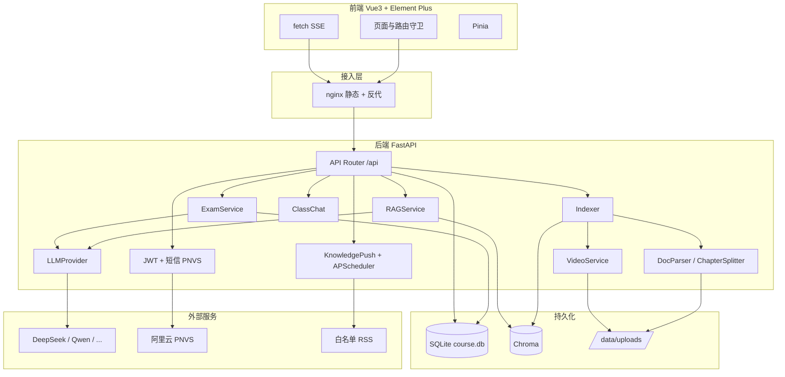
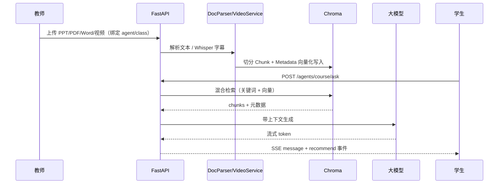
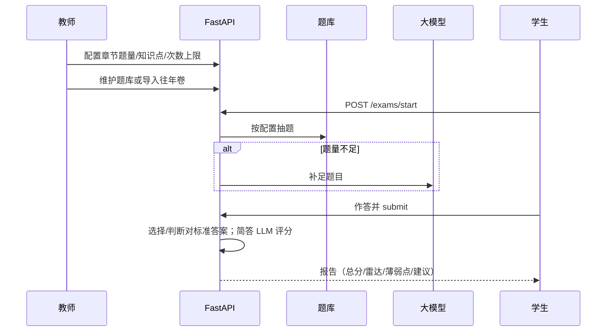

# 系统设计文档

> 对应《小学期课程实践项目说明书》提交物（3）项目文档 · 系统设计  
> 产品名：**CodeInfinity** · 默认种子课程：《C 语言程序设计》

---

## 一、项目背景与目标

大模型（LLM）与智能体（AI Agent）推动传统教务系统向智能教学平台演进。本项目在统一技术栈上实现一门完整的 **课程教学智能体 Web 系统**，覆盖 AI 应用开发全流程：需求分析、系统设计、RAG 知识库、接口与数据处理、前后端联调与 Docker 部署。

### 1.1 系统目标

构建多课程智能体教学平台，核心能力包括：

| 能力 | 说明 |
|------|------|
| 课程知识库（RAG） | 教师上传 PPT / PDF / Word / 视频 → 解析切分 → 写入向量库 → 支持检索增强生成 |
| 课程问答 | 基于 RAG 的 SSE 流式回答，并推荐相关学习资源（含视频时间戳） |
| 章节考核 | 教师配置题量与知识点 → 题库/LLM 组卷 → 自动评分 → 多维学习报告 |
| 班级教学 | 邀请码建班、按课程选课、智能体绑定、资料与考核按班/智能体隔离 |
| 扩展能力 | 教师智能体共享/采纳、课程群聊、薄弱点知识推送、往年卷导入拆题 |

架构上按 `Course` + `Agent` 扩展多门课；演示以 C 语言为主，同步支持教师自建其它课程智能体。

### 1.2 与统一平台要求的对应关系

| 平台要求模块 | 本系统实现 |
|--------------|------------|
| 公共基础（注册/登录/JWT/首页/对话/历史） | 认证 + 落地页 + 通用大模型对话 + 调用日志 |
| 教学资源库构建 | `materials` + `indexer` + Chroma |
| 习题—知识点标注 | `question_bank` / `knowledge_points` / 考卷导入 |
| 课程问答 + 资源推荐 | `POST /api/agents/course/ask`（SSE）+ `/api/recommend` |
| 章节考核 | `exam_configs` → 组卷 → 报告 → 判卷反馈/教师介入 |

---

## 二、总体架构

### 2.1 资料入库与课程问答时序

### 2.2 章节考核时序

---

## 三、技术栈与选型

| 模块 | 技术 | 选型说明 |
|------|------|----------|
| 前端 | Vue 3 + Vite + TypeScript + Element Plus + Pinia + Vue Router + ECharts | 课设统一要求；ECharts 用于考核雷达图 |
| 后端 | Python + FastAPI + SQLAlchemy 2 + Pydantic v2 | REST + SSE；lifespan 启停推送调度 |
| 关系库 | SQLite | 课设要求；路径由 `SQLITE_PATH` 配置 |
| 向量库 | Chroma 0.5.x | 课设可选 Chroma/Milvus；本项目用 Chroma 持久化 |
| 文本切分 | langchain-text-splitters | 仅用切分器，避免引入完整 LangChain 编排栈 |
| Embedding | ONNX MiniLM / 离线 Hash（可切换） | Docker 默认可离线；本机可 ONNX 提升检索质量 |
| LLM | DeepSeek（默认）/ Qwen / OpenAI·Gemini·Claude 兼容中转 / Moonshot / 智谱 | OpenAI 兼容协议统一封装 |
| 文档解析 | pdfplumber / python-pptx / python-docx | 对应 PPT/PDF/Word |
| 视频 ASR | ffmpeg + openai-whisper（可选） | Docker 镜像不装，本机开发可演示 |
| 短信 | 阿里云号码认证 PNVS | 开发模式固定验证码 |
| 调度 | APScheduler | 每日知识推送 |
| 部署 | Docker Compose + nginx | `docker compose up` 一键启动 |

---

## 四、逻辑模块划分

| 模块 | 后端路径 | 职责 |
|------|----------|------|
| 认证 | `api/auth.py`, `services/sms_service.py`, `aliyun_sms.py` | 注册/登录/短信验证码 |
| 用户与管理 | `api/users.py`, `api/admin.py` | 当前用户、用户 CRUD、全站日志与反馈 |
| 课程/章节 | `api/courses.py`, `api/chapters.py` | 课程列表、章节进度、自定义章 |
| 智能体 | `api/agents.py`, `api/teacher_agents.py` | 可见列表、课程 RAG 问答；教师创建/共享/采纳 |
| 班级 | `api/classes.py` | 建班、邀请码、师生管理、绑定智能体 |
| 群聊 | `api/class_chat.py` | 群消息、话题、私信、已读 |
| 资料与索引 | `api/materials.py`, `services/indexer.py`, `storage_paths.py` | 上传、教材拆章、路径解析、重建索引 |
| 向量存储 | `services/vector_store.py` | Chroma 集合、embedding 模式、增删查 |
| RAG / 推荐 | `services/rag_service.py`, `api/recommend.py` | 混合检索、流式生成、资源推荐 |
| 考核 | `api/exams.py`, `services/exam_service.py`, `exam_feedback_service.py` | 组卷、判分、报告、介入 |
| 考卷导入 | `api/exam_imports.py`, `exam_import_service.py` | 拆题、审核、发布入库 |
| 知识推送 | `api/knowledge_push.py`, `knowledge_push_service.py` | 拉取 RSS、匹配薄弱点、推送 |
| 对话 | `api/chat.py` | 通用 LLM 对话、附件与语音 |
| 配置与日志 | `api/llm.py`, `api/logs.py` | LLM 配置（管理员）、调用日志 |

前端按角色拆分页面，路由守卫见 `frontend/src/router/index.ts`；API 封装见 `frontend/src/api/index.ts`。

---

## 五、关键设计要点

### 5.1 角色与权限

| 角色 | 主要权限 |
|------|----------|
| student | 课程问答、章节考核、我的班级、知识推送、群聊、通用对话 |
| teacher | 上述 + 班级/资料/题库/考核配置/记录与介入/教师智能体/调用日志 |
| admin | 用户与智能体管理、全站考核与日志、LLM 配置、知识源与推送记录、AI 判卷反馈监控 |

鉴权：JWT Bearer（`Authorization: Bearer <token>`）。后端 `require_role`；前端路由 `meta.roles`。

### 5.2 多租户隔离

- **智能体**：`agents.owner_id`；共享 `is_shared`；采纳产生副本 `source_agent_id`
- **资料 / 知识点 / 考核配置**：可选 `agent_id`、`class_id`，问答与组卷按当前作用域过滤
- **选课**：`class_enrollments` 约束「同一课程最多一个班级」
- **向量库**：chunk metadata 携带 `material_id` / `chapter_id` / `agent_id` / `class_id` 等，检索时过滤

### 5.3 RAG 与 Embedding

1. 上传文件经 `storage_paths` 解析为当前环境可读路径（兼容 Windows 绝对路径与 Docker `/data/uploads`）。
2. 文档解析或视频 ASR → `RecursiveCharacterTextSplitter` 切分 → 写入 Chroma。
3. 问答时采用 **关键词检索为主 + 向量检索为辅** 的混合策略，再交 LLM 生成。
4. Embedding 模式（环境变量 `CHROMA_EMBEDDING_MODE`）：

| 模式 | 行为 | 集合名 |
|------|------|--------|
| `hash` / `offline` / `local` | 本地哈希向量，无外网依赖 | `course_knowledge_hash` |
| `onnx` | Chroma 默认 ONNX MiniLM | `course_knowledge` |
| `auto`（代码默认） | 本地已有 ONNX 缓存则用 ONNX，否则 hash（不触发下载） | 同上按结果选择 |

Docker Compose 默认 `CHROMA_EMBEDDING_MODE=hash`，保证国内网络下一键验收；本机开发可用 `auto`/`onnx` 获得更好检索效果。

### 5.4 流式协议（SSE）

课程问答与通用对话统一使用 Server-Sent Events：

- `Content-Type: text/event-stream`
- 典型事件：`message`（增量文本）、`recommend`（推荐资源列表）、结束标记
- nginx 对 `/api/` 关闭 buffering、拉长超时，避免 SSE/大文件上传中断

### 5.5 上传路径可移植性

`services/storage_paths.py`：

- `portable_upload_path`：写入 DB 时始终落在当前 `UPLOAD_DIR`
- `resolve_upload_path`：读取时优先原路径，失败则回退 `UPLOAD_DIR/文件名`（覆盖本机↔Docker 混用场景）

---

## 六、运行与数据路径

| 项 | 开发默认 | Docker |
|----|----------|--------|
| SQLite | `data/course.db` | `/data/course.db`（挂载 `./data`） |
| Chroma | `data/chroma` | `/data/chroma` |
| 上传 | `data/uploads` | `/data/uploads` |
| ONNX 缓存 | `~/.cache/chroma` | `./data/chroma_onnx_cache` → `/root/.cache/chroma` |
| 前端 | `http://localhost:5173` | `http://localhost`（nginx:80） |
| 后端 | `http://127.0.0.1:8000` | `http://localhost:8000` |

Windows 开发：`backend/install.bat` 安装依赖，`backend/dev.bat` 迁移 + 热重载。可选 `RUN_STARTUP_MIGRATIONS=1` 在 lifespan 内迁移（默认关闭以免热重载锁库）。

---

## 七、外部依赖配置

详见根目录 `.env.example`、`backend/.env.example` 与 `backend/app/config.py`：

| 类别 | 关键变量 |
|------|----------|
| LLM | `LLM_DEFAULT_PROVIDER`、`DEEPSEEK_*`、`QWEN_*` 等 |
| JWT | `JWT_SECRET`、`JWT_EXPIRE_MINUTES` |
| 短信 | `SMS_DEV_MODE`、`SMS_DEV_CODE`、`ALIYUN_*` / `ALIYUN_PNVS_*` |
| 存储 | `SQLITE_PATH`、`CHROMA_PATH`、`UPLOAD_DIR` |
| 向量 | `CHROMA_EMBEDDING_MODE`、`CHROMA_ONNX_MODEL_URL`（可选） |
| 视频 | `WHISPER_MODEL`、`FFMPEG_PATH`、`VIDEO_CHUNK_*` |
| 推送 | `KNOWLEDGE_PUSH_HOUR/MINUTE/LIMIT`、`SEARCH_API_KEY`（可选 Bing） |

密钥勿提交仓库。Docker 部署至少配置 `DEEPSEEK_API_KEY`。
