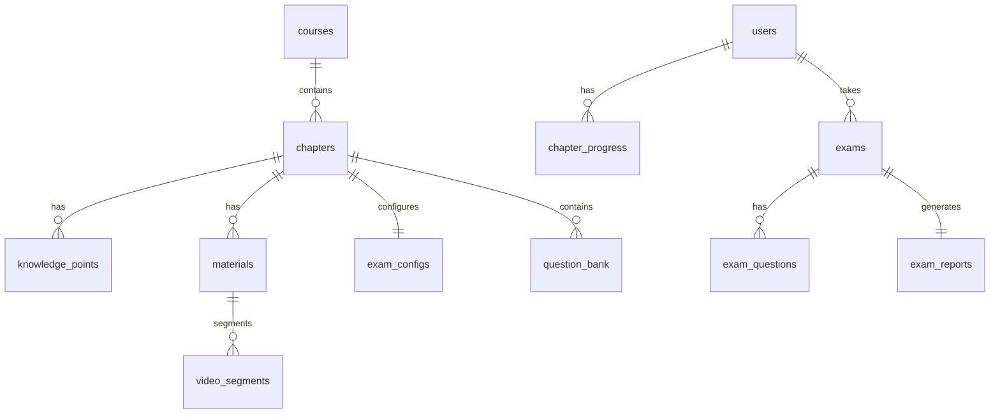

# 数据结构设计文档

## 一、关系数据库（SQLite）

通过 SQLAlchemy 2.x ORM 定义，建表脚本见 `backend/scripts/init_db.py`。

### users 用户表
| 字段 | 类型 | 约束 | 说明 |
|------|------|------|------|
| id | INTEGER | PK | 主键 |
| username | VARCHAR(64) | UNIQUE | 用户名 |
| password_hash | VARCHAR(255) | NOT NULL | bcrypt 哈希 |
| role | VARCHAR(16) | 默认 student | student/teacher/admin |
| display_name | VARCHAR(64) | 默认 '' | 昵称 |
| created_at | DATETIME | server_default now | 创建时间 |

### courses 课程表
| 字段 | 类型 | 说明 |
|------|------|------|
| id | INTEGER PK | |
| name | VARCHAR(128) | 课程名 |
| description | TEXT | 简介 |

### chapters 章节表
| 字段 | 类型 | 说明 |
|------|------|------|
| id | INTEGER PK | |
| course_id | FK → courses.id | |
| title | VARCHAR(128) | 章节标题 |
| order_idx | INTEGER | 排序 |
| description | TEXT | 章节描述 |

### knowledge_points 知识点表
| 字段 | 类型 | 说明 |
|------|------|------|
| id | INTEGER PK | |
| chapter_id | FK → chapters.id | |
| name | VARCHAR(128) | 知识点名 |

### materials 资料表
| 字段 | 类型 | 说明 |
|------|------|------|
| id | INTEGER PK | |
| chapter_id | FK → chapters.id | |
| type | VARCHAR(16) | ppt/pdf/video/word |
| title | VARCHAR(255) | 资料标题 |
| file_path | VARCHAR(512) | 服务器绝对路径 |
| meta_json | JSON | 扩展元数据 |
| created_at | DATETIME | 上传时间 |

### video_segments 视频字幕分段表
| 字段 | 类型 | 说明 |
|------|------|------|
| id | INTEGER PK | |
| video_id | FK → materials.id | |
| start_sec | INTEGER | 起始秒 |
| end_sec | INTEGER | 结束秒 |
| subtitle_text | TEXT | 该段字幕 |

### exam_configs 考核配置表
| 字段 | 类型 | 说明 |
|------|------|------|
| id | INTEGER PK | |
| chapter_id | FK → chapters.id, UNIQUE | 一章一配置 |
| config_json | JSON | `{"选择题":2,"判断题":2,"简答题":2,"knowledge_points":[...]}` |

### question_bank 题库表
| 字段 | 类型 | 说明 |
|------|------|------|
| id | INTEGER PK | |
| chapter_id | FK → chapters.id | |
| kp_id | FK → knowledge_points.id, nullable | |
| type | VARCHAR(16) | 选择题/判断题/简答题 |
| stem | TEXT | 题干 |
| options_json | JSON | 选项列表 `["A. ...","B. ..."]` |
| answer | TEXT | 正确答案 |
| analysis | TEXT | 解析 |

### exams 考核记录表
| 字段 | 类型 | 说明 |
|------|------|------|
| id | INTEGER PK | |
| user_id | FK → users.id | |
| chapter_id | FK → chapters.id | |
| status | VARCHAR(16) | ongoing/submitted |
| started_at | DATETIME | 开始时间 |
| submitted_at | DATETIME, nullable | 提交时间 |

### exam_questions 考试题目表
| 字段 | 类型 | 说明 |
|------|------|------|
| id | INTEGER PK | |
| exam_id | FK → exams.id | |
| idx | INTEGER | 题号 |
| source | VARCHAR(8) | bank/llm |
| type | VARCHAR(16) | 题型 |
| stem | TEXT | 题干 |
| options_json | JSON | 选项 |
| correct_answer | TEXT | 正确答案 |
| user_answer | TEXT | 学生作答 |
| is_correct | BOOLEAN, nullable | 是否正确 |
| ai_score | FLOAT, nullable | AI 评分 0-100 |
| ai_feedback | TEXT | AI 评语 |

### exam_reports 评价报告表
| 字段 | 类型 | 说明 |
|------|------|------|
| id | INTEGER PK | |
| exam_id | FK → exams.id, UNIQUE | |
| dimensions_json | JSON | 4 维度分数 |
| summary | TEXT | 总体评价 |
| suggestions | TEXT | 复习建议 |
| created_at | DATETIME | 生成时间 |

### chapter_progress 章节进度表
| 字段 | 类型 | 说明 |
|------|------|------|
| id | INTEGER PK | |
| user_id | FK → users.id | |
| chapter_id | FK → chapters.id | |
| status | VARCHAR(16) | 未完成/已完成/待学习 |
| last_exam_id | INTEGER, nullable | 最近考核 ID |

### llm_configs 大模型配置表
| 字段 | 类型 | 说明 |
|------|------|------|
| id | INTEGER PK | |
| provider | VARCHAR(32) | deepseek/openai/qwen |
| api_key | VARCHAR(255) | |
| base_url | VARCHAR(255) | |
| model | VARCHAR(64) | |
| is_default | BOOLEAN | 是否默认 |

### agents 智能体表
| 字段 | 类型 | 说明 |
|------|------|------|
| id | INTEGER PK | |
| name | VARCHAR(64) | |
| intro | TEXT | 介绍 |
| endpoint | VARCHAR(128) | 调用入口 |

### call_logs 调用日志表
| 字段 | 类型 | 说明 |
|------|------|------|
| id | INTEGER PK | |
| user_id | INTEGER, nullable | |
| endpoint | VARCHAR(128) | |
| req_summary | TEXT | 请求摘要 |
| resp_summary | TEXT | 响应摘要 |
| tokens | INTEGER | token 数 |
| latency_ms | INTEGER | 耗时 |
| created_at | DATETIME | |

## 二、向量数据库（Chroma）

### Collection: `course_knowledge`

存储文档/字幕切片及其向量嵌入。

| 字段 | 类型 | 说明 |
|------|------|------|
| id | string | `m{material_id}-c{chunk_idx}` |
| document | string | 切片文本 |
| embedding | vector(384) | all-MiniLM-L6-v2 嵌入 |
| metadata | dict | 见下 |

#### metadata 字段
| 字段 | 类型 | 说明 |
|------|------|------|
| material_id | str | 来源资料 ID |
| chapter_id | str | 章节 ID |
| type | str | ppt/pdf/video/word |
| title | str | 资料标题 |
| page | str | 页码（文档） |
| start_sec | str | 视频起始秒 |
| end_sec | str | 视频结束秒 |
| chunk_idx | str | 切片序号 |

> 注：Chroma metadata 值仅支持 str/int/float/bool，列表与 None 在写入时统一转为 str。

## 三、ER 关系图

