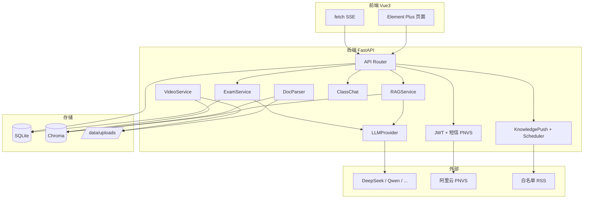
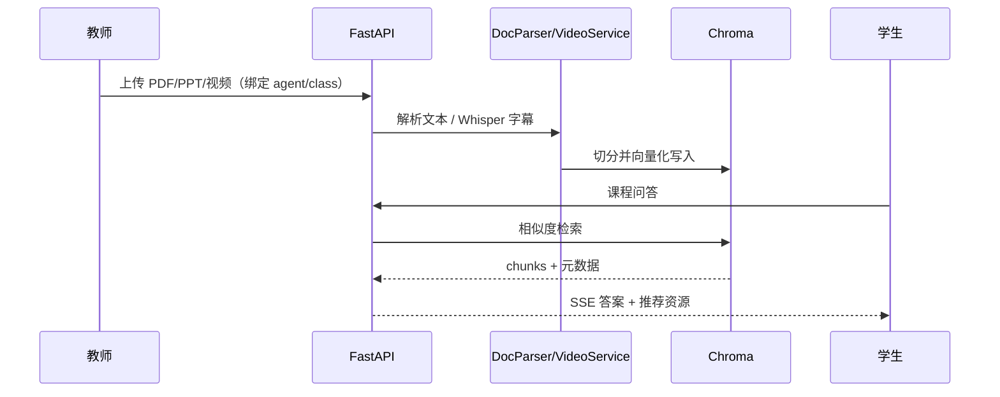

# 系统设计文档

## 一、系统目标

构建多课程智能体教学平台 **CodeInfinity**，支持：

1. **课程问答**：RAG 检索 PPT/PDF/Word/视频字幕，SSE 流式回答  
2. **学习资源推荐**：按问题与章节推荐资料，视频支持时间戳跳转  
3. **章节考核**：教师配置 + 题库/LLM 组卷 → 自动评分 → 多维报告；判卷反馈与教师介入  
4. **班级教学**：选课入班、智能体绑定、资料与考核按班级/智能体隔离  
5. **扩展能力**：教师智能体共享采纳、课程群聊、知识推送、往年卷导入拆题  

默认种子课程为《C 程序设计快速进阶大学教程》，架构上按 `Course` + `Agent` 扩展多门课。

## 二、总体架构

### 资料入库与问答

## 三、技术栈与选型

| 模块 | 技术 | 说明 |
|------|------|------|
| 前端 | Vue3 + Vite + TS + Element Plus + Pinia | SPA；ECharts 报告雷达图 |
| 后端 | FastAPI + SQLAlchemy 2 + Pydantic v2 | REST + SSE；lifespan 启停推送调度 |
| 数据库 | SQLite | 课设部署简单；路径 `SQLITE_PATH` |
| 向量库 | Chroma 0.5.x | 默认 ONNX embedding，无需 sentence-transformers |
| 切分 | langchain-text-splitters | 仅用文本切分器 |
| LLM | OpenAI 兼容多提供商 | 环境变量或库内 `llm_configs` |
| 短信 | PNVS dypnsapi | 个人可开通；开发模式本地固定码 |
| 视频 | ffmpeg + Whisper | `requirements_video.txt` 可选安装 |
| 调度 | APScheduler | 每日知识推送 |
| 部署 | Docker Compose + nginx | 前端静态 + 反代 |

## 四、逻辑模块

| 模块 | 后端路径 | 职责 |
|------|----------|------|
| 认证 | `api/auth.py`, `services/sms_service.py`, `aliyun_sms.py` | 注册/登录/短信 |
| 用户与管理 | `api/users.py`, `api/admin.py` | 当前用户、用户 CRUD、全站日志与反馈 |
| 课程/章节 | `api/courses.py`, `api/chapters.py` | 课程列表、章节进度 |
| 智能体 | `api/agents.py`, `api/teacher_agents.py` | 列表问答；教师创建/共享/采纳 |
| 班级 | `api/classes.py` | 建班、邀请码、师生管理、绑定智能体 |
| 群聊 | `api/class_chat.py` | 群消息、话题、私信、已读 |
| 资料 | `api/materials.py`, `services/indexer.py` | 上传、教材拆章、重建索引 |
| RAG / 推荐 | `services/rag_service.py`, `api/recommend.py` | 检索生成、资源推荐 |
| 考核 | `api/exams.py`, `services/exam_service.py` | 组卷、判分、报告、介入 |
| 考卷导入 | `api/exam_imports.py`, `exam_import_service.py` | 拆题、审核、发布入库 |
| 知识推送 | `api/knowledge_push.py`, `knowledge_push_*.py` | 拉取、匹配薄弱点、推送 |
| 对话 | `api/chat.py` | 通用 LLM 对话、附件与语音 |
| 配置与日志 | `api/llm.py`, `api/logs.py` | LLM 配置（管理员）、调用日志 |

## 五、角色与权限

| 角色 | 主要权限 |
|------|----------|
| student | 问答、考核、我的班级、知识推送、群聊 |
| teacher | 上述 + 班级/资料/题库/考核配置/记录与介入/教师智能体/调用日志 |
| admin | 用户与智能体管理、全站考核与日志、LLM 配置、知识源与推送记录、AI 判卷反馈监控；不走学生侧「我的智能体」列表（重定向至管理页） |

鉴权：JWT Bearer。路由守卫见 `frontend/src/router/index.ts`；后端 `require_role`。

## 六、多租户隔离要点

- **智能体**：`agents.owner_id`；共享 `is_shared`；采纳产生副本 `source_agent_id`  
- **资料 / 知识点 / 考核配置**：可选 `agent_id`、`class_id`，问答与组卷按当前作用域过滤  
- **选课**：`class_enrollments` 约束「同一课程最多一个班级」  
- **向量库**：chunk metadata 携带 `material_id` / `chapter_id` / `agent_id` 等，检索时过滤  

## 七、运行与数据路径

| 项 | 默认 |
|----|------|
| SQLite | `data/course.db` |
| Chroma | `data/chroma` |
| 上传 | `data/uploads` |
| 前端开发 | `http://localhost:5173` |
| 后端开发 | `http://127.0.0.1:8000` |

Windows 开发：`backend/install.bat` 安装依赖，`backend/dev.bat` 迁移 + 热重载。可选 `RUN_STARTUP_MIGRATIONS=1` 在 lifespan 内迁移（默认关闭以免热重载锁库）。

## 八、外部依赖配置

详见 `backend/.env.example` 与 `backend/app/config.py`：

- **LLM**：`LLM_DEFAULT_PROVIDER`、`DEEPSEEK_*`、`QWEN_*` 等  
- **JWT**：`JWT_SECRET` 等  
- **SMS**：`SMS_DEV_MODE`、PNVS AccessKey / 签名 / 模板  
- **视频**：`WHISPER_MODEL`、`FFMPEG_PATH`、`VIDEO_CHUNK_*`  
- **推送**：`KNOWLEDGE_PUSH_*`、`SEARCH_API_KEY`（可选）  
