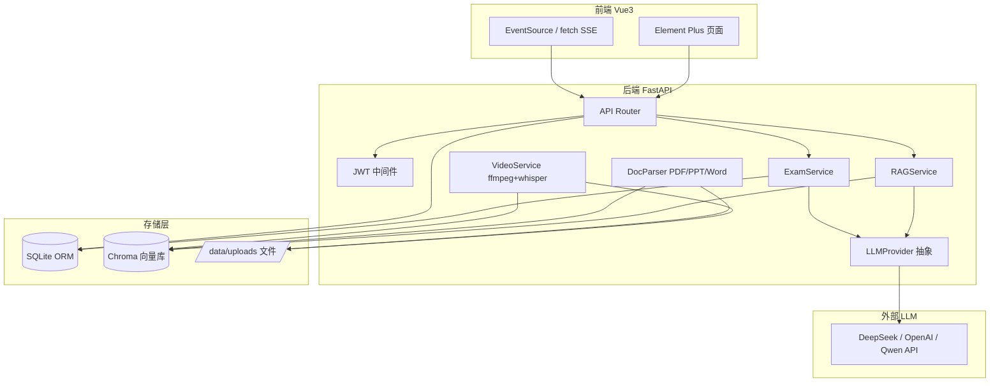
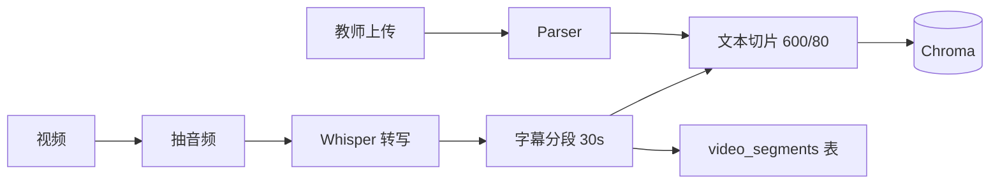
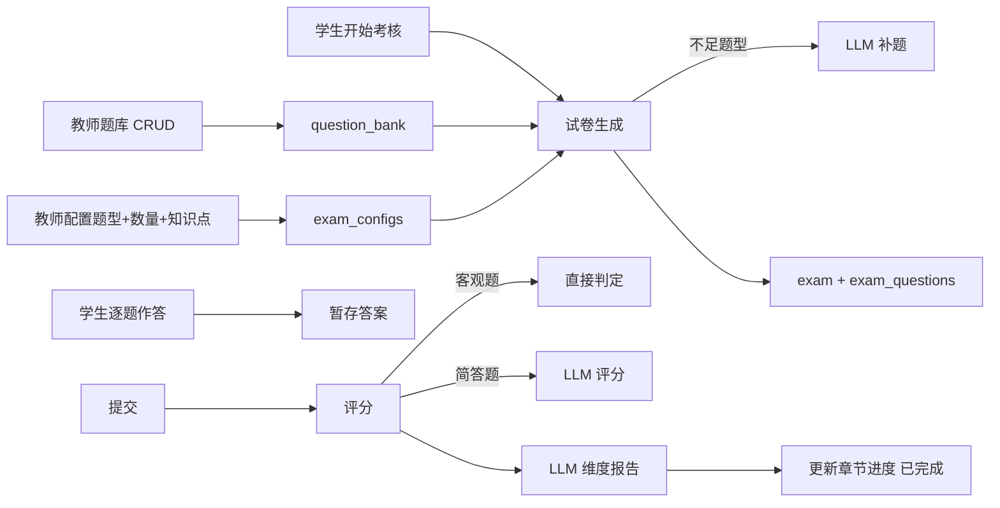

# 系统设计文档

## 一、系统目标

构建《C语言程序设计》课程智能体 Web 系统，集成：

1. **课程问答**：基于 RAG 从 PPT/PDF/Word/视频字幕中检索并流式回答学生提问
2. **学习资源推荐**：根据当前章节/问题推荐 PPT、PDF、视频，视频支持时间戳精准跳转
3. **章节考核（重点）**：教师配置题型与数量 → 题库+LLM 动态生成试卷 → 学生逐题作答 → 自动评分与维度评价报告

## 二、总体架构



```
sequenceDiagram
    participant T as 教师/管理员
    participant UI as 前端页面
    participant API as 后端 API
    participant P as DocParser/VideoService
    participant C as Chroma向量库
    participant A as 课程智能体

    T->>UI: 上传教学资料（PDF/PPT/视频）
    UI->>API: 发送文件
    API->>P: 调用解析服务
    P->>P: 提取文本/字幕
    P->>C: 向量化并存储
    C-->>A: 新知识已入库

    Note over T,A: 之后学生提问时

    S->>A: 提问：指针和数组的区别？
    A->>C: 检索相关片段
    C-->>A: 返回新资料中的匹配内容
    A->>S: 结合新资料生成回答
```
## 三、技术栈

| 模块 | 技术 | 选型理由 |
|------|------|----------|
| 前端 | Vue3 + Vite + Element Plus + Pinia + Vue Router | 现代 SPA，生态成熟，组件丰富 |
| 后端 | Python 3.11 + FastAPI + SQLAlchemy 2.x | 异步支持 SSE，自动 OpenAPI 文档 |
| 数据库 | SQLite | 单文件部署，零运维 |
| 向量库 | Chroma（persistent） | 轻量本地，与 SQLite 同风格 |
| 嵌入 | sentence-transformers `all-MiniLM-L6-v2` | 本地嵌入，无 API 成本 |
| RAG | LangChain `RecursiveCharacterTextSplitter` | 成熟切分器 |
| LLM | DeepSeek（默认）/ OpenAI / Qwen | OpenAI 兼容协议统一抽象 |
| 文档解析 | pdfplumber / python-pptx / python-docx | 主流格式全覆盖 |
| 视频 | ffmpeg + openai-whisper | 字幕转写 + 时间戳锚点 |
| 流式 | sse-starlette `EventSourceResponse` | 标准 SSE |
| 认证 | python-jose JWT + passlib bcrypt | 业内标准 |
| 部署 | Docker + docker-compose | 一键启动 |

## 四、模块设计

### 4.1 用户与权限

- 三种角色：`student` / `teacher` / `admin`
- JWT Bearer Token，过期时间可配置（默认 24h）
- 角色守卫通过 `require_role()` 依赖注入实现

### 4.2 知识库构建



- 切片元数据携带 `material_id / chapter_id / type / page / start_sec / end_sec / title`
- 视频字幕切片带时间戳，检索命中后可回溯到视频具体秒数

### 4.3 RAG 问答

- 检索 Chroma `top-5`（可按 chapter 过滤）
- 组装 system prompt + 历史 + 用户问题
- LLM 流式生成，前端 SSE 增量渲染
- 同步基于命中 chunk 反查资料生成「建议学习」资源列表

### 4.4 章节考核



## 五、关键流程

### 5.1 SSE 流式协议

`POST /api/agents/course/ask` 返回 `text/event-stream`：

```
event: recommend
data: {"recommendations": [{...}]}

event: message
data: {"text": "AVL树是..."}

event: message
data: [DONE]
```

### 5.2 LLM 同步调用

FastAPI sync 路由运行在 threadpool，LLM 调用通过 `_run_sync()` 在独立线程+新事件循环中执行 `provider.chat()`，避免阻塞主事件循环。

## 六、部署架构

```
docker-compose
├── backend  (uvicorn :8000)
│   └── volume /data → ./data
└── frontend (nginx :80)
    └── 反代 /api/ → backend:8000
```

`data/` 目录持久化 SQLite、Chroma、上传文件。
